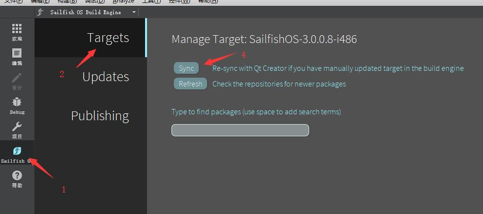

# Sailfish OS的新浪微博应用

初始版本基于Ubuntu Touch的新浪微博应用（http://bbs.qter.org/forum.php?mod=viewthread&tid=1035&extra=page%3D1）
目前经过了大量的代码重写/重构，功能添加等，已与原始版本相差甚远


### TODO: 
* 优化Gallery页面显示大图功能
* Emoji显示问题（似乎由Sailfish OS本身的问题所引起，暂时等待上游更新）


### 使用QtCreator编译的方法

#### 下载依赖库
`git submodule update --init --recursive`

### 安装依赖
#### Arm:
```
sb2 -t SailfishOS-3.0.0.8-armv7hl -m sdk-install -R zypper ar -f https://sailfish.openrepos.net/birdzhang/personal-main.repo openrepos-birdzhang
sb2 -t SailfishOS-3.0.0.8-armv7hl -m sdk-install -R zypper ref openrepos-birdzhang
sb2 -t SailfishOS-3.0.0.8-armv7hl -m sdk-install -R zypper in htmlcxx htmlcxx-devel
```
#### X86
```
sb2 -t SailfishOS-3.0.0.8-i486 -m sdk-install -R zypper ar -f https://sailfish.openrepos.net/birdzhang/personal-main.repo openrepos-birdzhang
sb2 -t SailfishOS-3.0.0.8-i486 -m sdk-install -R zypper ref openrepos-birdzhang
sb2 -t SailfishOS-3.0.0.8-i486 -m sdk-install -R zypper in htmlcxx htmlcxx-devel
```

然后在Sailfish SDK中按下图所示*同步*一下，第三步为选择要更新的target




### 在项目中添加lib依赖

* 1. .pro文件中添加 
    ```
    LIBS += -lhtmlcxx
    INCLUDEPATH += \
    /usr/include/htmlcxx
    ```
* 2. .rpm文件中添加 
    ```
    BuildRequires:   htmlcxx
    BuildRequires:   htmlcxx-devel
    Requires:   htmlcxx
    ```

### 在目标机器上安装htmlcxx

```
devel-su 
pkcon install zypper
zypper ar -f https://sailfish.openrepos.net/birdzhang/personal-main.repo openrepos-birdzhang
zypper ref openrepos-birdzhang
zypper in htmlcxx
```

### 使用

现在，你可以在c++项目中使用了
```
#include "htmlcxx/html/tree.h"
#include "htmlcxx/html/ParserDom.h"
#include "htmlcxx/html/Node.h"
```